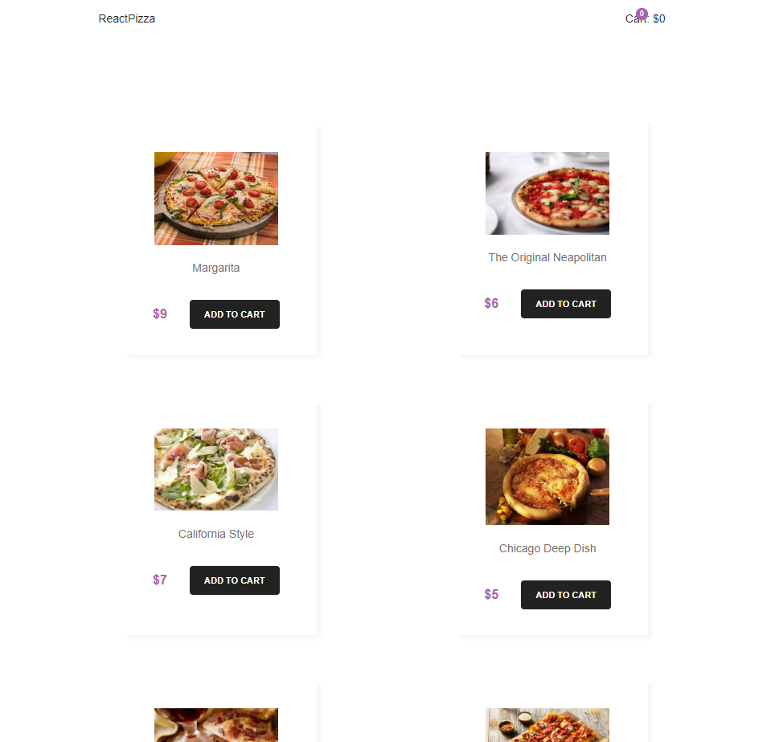

# Documentation

## Prerequisites

You need the following setup to deploying the application:

In the BackEnd folder & and Client folder run:

### `npm install`
  
* In backEnd/config.defaul.json change the mongoURI to yours
* Launch backEnd server / connection to mongoDB (atlas) and React front-end server with:
  
### `npm run dev`

## Source code

* Git Flow can be assessed here: 
* https://github.com/Yariandres/BackEnd-ordering-system/commits/master
* https://github.com/Yariandres/FrondEnd-ordering-system/commits/master

* Full working application can be found at this URL: 
* https://shielded-thicket-83627.herokuapp.com/

## Screenshot

 
